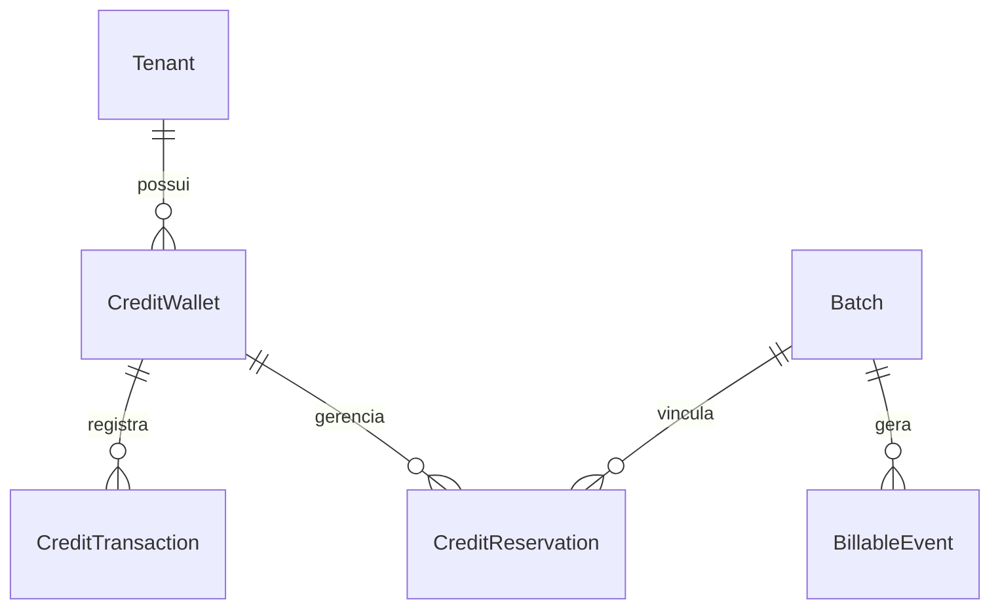
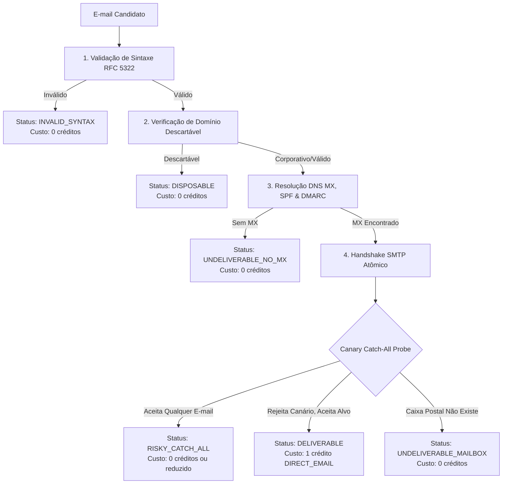

# Especificação de Design: Sistema de Carteira/Créditos (Pay-Per-Value) e Motor de Entregabilidade de E-mail Zero-Bounce

**Data:** 2026-09-11  
**Autor:** Antigravity (Advanced Agentic Coding)  
**Status:** Aprovado para Implementação  
**Escopo:** Architectural  

---

## 1. Contexto e Objetivos

O LeadStream Backend atua como motor central de inteligência e enriquecimento de dados empresariais B2B. Para alcançar o patamar dos líderes globais do mercado (Apollo, ZoomInfo, Clay), o sistema necessita de dois diferenciais competitivos fundamentais:

1. **Monetização por Valor Real (Pay-Per-Value Credit Ledger):**
   - Eliminar a cobrança de leads sem dado útil ou com canais de contato inexistentes.
   - Implementar uma conta-corrente de créditos com contabilidade imutável de dupla entrada (`CreditWallet`, `CreditReservation`, `CreditTransaction`).
   - Ciclo de vida da cobrança em lotes: **Reserva Prévia (Hold) $\to$ Débito Real (Capture) $\to$ Estorno/Desbloqueio de Excedente (Release)**.
   - Concessão de saldo de cortesia (500 créditos) para novos workspaces e modo ilimitado para o tenant interno.

2. **Motor de Entregabilidade de E-mail Zero-Bounce (SMTP Deep Probe):**
   - Verificação atômica de e-mails em 5 níveis antes da entrega e antes da cobrança.
   - Handshake SMTP seguro (`EHLO`, `MAIL FROM`, `RCPT TO`, `RSET`, `QUIT`) sem envio de mensagem real, com detecção de servidores *Catch-All* via endereço canário.
   - Garantia contratual: o bloco `DIRECT_EMAIL` **só consome créditos se o status for estritamente `DELIVERABLE`**. Se for `UNDELIVERABLE`, `RISKY_CATCH_ALL` ou `INVALID_SYNTAX`, o dado pode ser informado com o devido alerta técnico, mas o crédito é **estornado/isento de cobrança**.

---

## 2. Modelagem de Dados e Arquitetura

### 2.1 Módulo Financeiro: `leadstream.billing`

#### Modelo `CreditWallet`
- `tenant` (OneToOneField com `Tenant`, cascade)
- `balance` (IntegerField, padrão: 0, saldo disponível não reservado)
- `reserved_balance` (IntegerField, padrão: 0, créditos retidos em processamentos em andamento)
- `is_unlimited` (BooleanField, padrão: False; True para tenant interno)
- `auto_recharge` (BooleanField, padrão: False)
- `recharge_threshold` (IntegerField, padrão: 100)
- `updated_at` (DateTimeField)

#### Modelo `CreditReservation`
- `id` (UUID)
- `wallet` (ForeignKey para `CreditWallet`)
- `batch` (ForeignKey para `Batch`, null=True, blank=True)
- `amount` (PositiveIntegerField, valor reservado)
- `captured_amount` (PositiveIntegerField, padrão: 0)
- `released_amount` (PositiveIntegerField, padrão: 0)
- `status` (CharField choices: `ACTIVE`, `SETTLED`, `CANCELLED`)
- `description` (CharField)
- `expires_at` (DateTimeField, expiração automática se o job travar)
- `created_at` (DateTimeField)

#### Modelo `CreditTransaction` (Append-Only)
- `id` (UUID)
- `wallet` (ForeignKey para `CreditWallet`)
- `reservation` (ForeignKey para `CreditReservation`, null=True, blank=True)
- `transaction_type` (CharField choices: `DEPOSIT`, `HOLD`, `CAPTURE`, `RELEASE`, `BONUS`, `ADJUSTMENT`)
- `amount` (IntegerField, positivo para entradas, negativo para saídas)
- `balance_after` (IntegerField, saldo resultante após a transação)
- `reference_id` (CharField, ex: ID do lote ou do evento)
- `metadata` (JSONField, ex: breakdown de blocos cobrados e estornados)
- `created_at` (DateTimeField)

---

### 2.2 Módulo de Validação: `leadstream.validation`

#### Estágios do Verificador de E-mail
1. **Sintaxe**: Regex rigorosa + compliance com RFC 5322.
2. **Descartáveis**: Blacklist em memória e constante de 50+ provedores temporários (Mailinator, GuerrillaMail, etc.).
3. **DNS MX**: Consulta assíncrona/em cache de registros MX prioritários, com fallback para registro A.
4. **SMTP Probe**:
   - Conexão TCP na porta 25 (com timeout configurável de 3.0s).
   - Sequência `EHLO leadstream.com.br` $\to$ `MAIL FROM:<verify@leadstream.com.br>`.
   - Envio de endereço canário (`leadstream_probe_test_xyz@domain.com`) para testar comportamento de *Catch-All*.
   - Envio de `RCPT TO:<alvo@domain.com>`.
   - Se 250 OK para o alvo e rejeição para o canário $\implies$ `DELIVERABLE` com certeza absoluta.
   - Se 250 OK para ambos $\implies$ `RISKY_CATCH_ALL` (o domínio aceita qualquer endereço, risco de bounce).
   - Se 550 / 551 / 553 $\implies$ `UNDELIVERABLE_MAILBOX_NOT_FOUND`.
   - Se 450 / 451 $\implies$ `GREYLISTED_TEMPORARY`.
5. **Cache de Entregabilidade**:
   - Guarda o resultado do domínio por 48 horas em cache Redis/Memória para não sobrecarregar servidores de e-mail e não tomar blacklist de IP.

---

## 3. Catálogo de Endpoints da API

### 3.1 Carteira e Faturamento (`/api/v1/faturamento/`)
| Método | Rota | Descrição |
|---|---|---|
| `GET` | `/api/v1/faturamento/carteira/` | Retorna saldo disponível, reservado e total da carteira do workspace ativo |
| `GET` | `/api/v1/faturamento/carteira/extrato/` | Lista transações e extrato histórico de créditos (paginado) |
| `POST` | `/api/v1/faturamento/carteira/recarga/` | Adiciona créditos à carteira (simulado / integração gateway) |

### 3.2 Validação de E-mail (`/api/v1/validacao/`)
| Método | Rota | Descrição |
|---|---|---|
| `POST` | `/api/v1/validacao/emails/` | Validação atômica em tempo real de 1 ou mais e-mails com diagnóstico completo de entregabilidade |

---

## 4. Integração com a Esteira de Lotes (Pipeline Integration)

1. **Submissão de Lote (`POST /api/v1/lotes/`)**:
   - Estima custo máximo: `total_rows * sum(unit_prices dos blocos solicitados)`.
   - Verifica se a carteira possui `balance >= estimated_credits`.
   - Cria `CreditReservation(status="ACTIVE", amount=estimated_credits)`.
   - Deduz temporariamente de `balance` e adiciona em `reserved_balance`.
   - Se saldo insuficiente, rejeita com HTTP 402 (`INSUFFICIENT_CREDITS`).

2. **Execução dos Workers Celery**:
   - Cada lead enriquecido que descobre e-mail passa pelo validador SMTP.
   - Apenas e-mails `DELIVERABLE` geram `BillableEvent` para `DIRECT_EMAIL`.

3. **Finalização do Lote (`completed`)**:
   - Soma o valor real faturado de todos os `BillableEvent` do lote (`actual_amount`).
   - `CreditWallet.capture_reservation(reservation, actual_amount)`:
     - `CAPTURE` de `actual_amount`.
     - `RELEASE` de `(reservation.amount - actual_amount)`.
     - Atualiza `reserved_balance` e restaura o saldo não utilizado para `balance`.
     - Marca reserva como `SETTLED`.

---

## 5. Plano de Testes e Validação
- Testes unitários para `CreditWallet`, `CreditReservation` e `CreditTransaction` (operações atômicas, bloqueio por saldo insuficiente, concorrência).
- Testes de mock SMTP para os 5 cenários (`DELIVERABLE`, `RISKY_CATCH_ALL`, `UNDELIVERABLE`, `NO_MX`, `DISPOSABLE`).
- Testes de integração da API REST de carteira e verificação de e-mail.
- Testes do fluxo completo: upload de lote $\to$ reserva $\to$ processamento $\to$ liquidação com estorno por e-mails inválidos.
